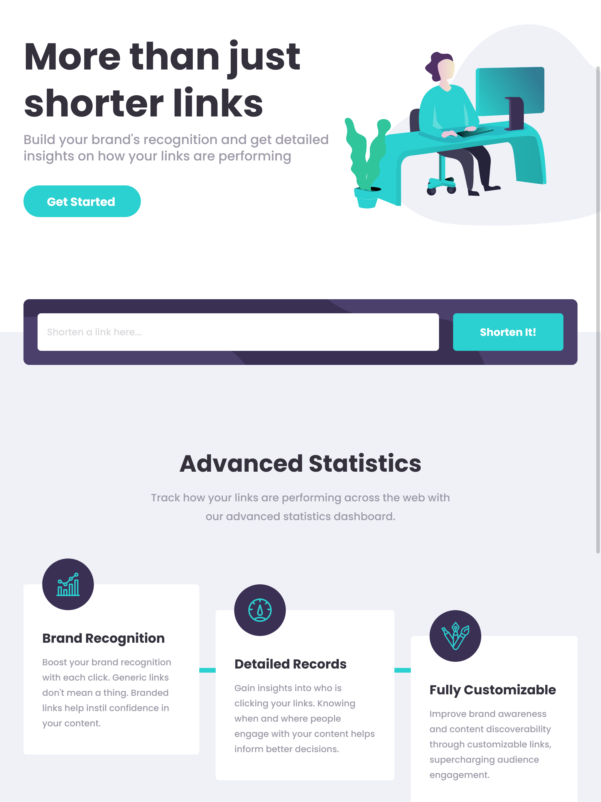

# Frontend Mentor - Shortly URL shortening API Challenge solution

This is a solution to the [Shortly URL shortening API Challenge challenge on Frontend Mentor](https://www.frontendmentor.io/challenges/url-shortening-api-landing-page-2ce3ob-G). Frontend Mentor challenges help you improve your coding skills by building realistic projects. 

## Table of contents

- [Overview](#overview)
  - [The challenge](#the-challenge)
  - [Screenshot](#screenshot)
  - [Links](#links)
- [My process](#my-process)
  - [Built with](#built-with)
  - [What I learned](#what-i-learned)
  - [Continued development](#continued-development)
- [Author](#author)

## Overview

### The challenge

Users should be able to:

- View the optimal layout for the site depending on their device's screen size
- Shorten any valid URL
- See a list of their shortened links, even after refreshing the browser
- Copy the shortened link to their clipboard in a single click
- Receive an error message when the `form` is submitted if:
  - The `input` field is empty

### Screenshot




### Links

- [Solution on Frontend Mentor](https://www.frontendmentor.io/solutions/react-js-styled-components-SOpXIbYuo)
- [Live Demo](https://url-shortening-api-ten-gray.vercel.app/)

## My process

### Built with

- Mobile-first workflow
- [React](https://reactjs.org/) - JS library
- [Styled Components](https://styled-components.com/)
- [React Router](https://reactrouter.com/)
- [React Scroll](https://github.com/fisshy/react-scroll)

### What I learned

This was my first independent project using Create React App and styled components. I gained experience breaking the project down into components and creating custom hooks.

- All shortened links are saved to local storage, so I added a delete button to the cards for better UI. 

- I wanted to implement a scroll effect using the React scroll component, so I added a 'Try it out' link to the top menu. As this only makes sense on the home page, I created a custom hook to check whether the current page is a specified path and conditionally render the component.

```js
// custom hook
const useComparePath = (path) => {
    const [currentPath, setCurrentPath] = useState(window.location.pathname);

    useEffect(() => {
        const onLocationChange = () => {
            setCurrentPath(window.location.pathname);
        }
        window.addEventListener('popstate', onLocationChange);
        return () => {
            window.removeEventListener('popstate', onLocationChange);
        }
    }, [currentPath]);
    return (currentPath === path);
}
// In the header component
const isHome = useComparePath('/');

{ isHome ? 
    <LinkWithin to='try-app' smooth={true} duration={500} spy={true} exact='true' offset={-60} tabIndex='0' fontSize='1rem' fontWeight='700' color='var(--text-med)' hoverColor='var(--text-dark)'>Try It Out</LinkWithin> 
: null }
```

- I learnt how to create a custom loader animation using styled components.

- I would like to add a page to this project - a sign up form, so I set it up using React Router to make this easy to do in the future.


### Continued development

- React scroll links don't seem to work like normal links which poses an accessibility challenge - I added a tabindex in the markup to make them focusable but they cannot be activated with the Enter key - I will need to come up with a solution to this.

- I also need to explore accessibility of the link-shortening api - how to announce loading a link, and a result showing up on the screen.

## Author

- Frontend Mentor - [@AgataLiberska](https://www.frontendmentor.io/profile/AgataLiberska)
- Twitter - [@AgataLiberska](https://twitter.com/AgataLiberska)
